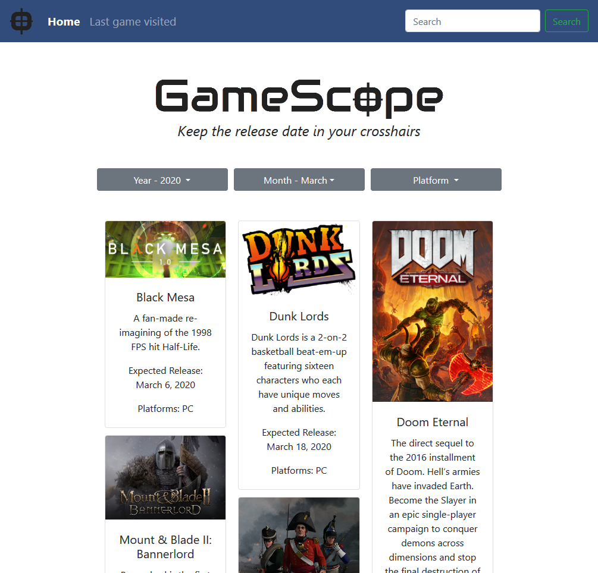
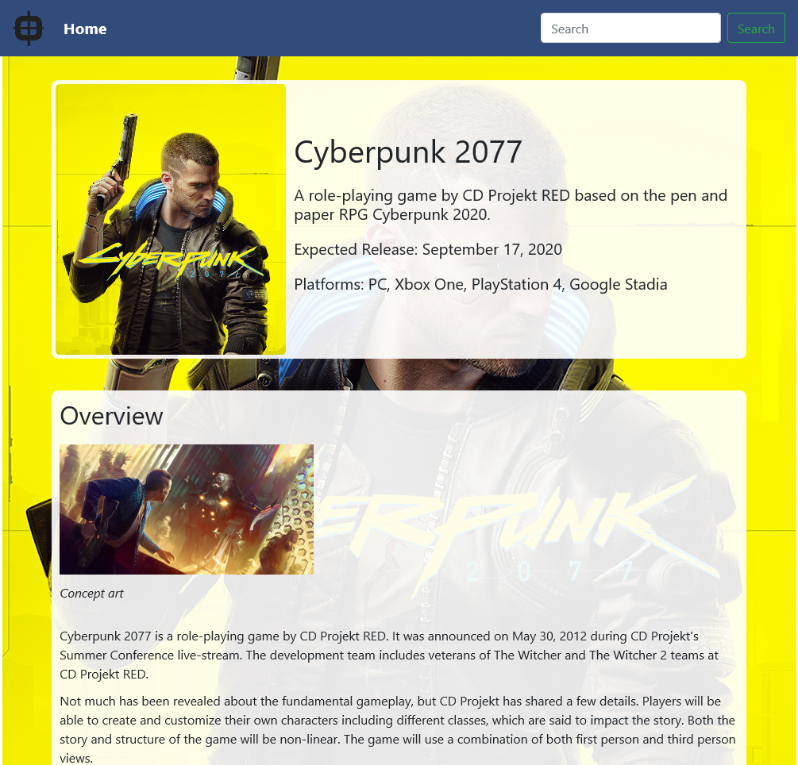

# GameScope
GameScope provides users the ability to view what games will be released via
user-specified filters. Users can additionally click on games to view more information
about the game along with news articles (if available).

___

## API tools used
* [GiantBomb](https://www.giantbomb.com/api/documentation/) (3 endpoints)
* [News API](https://newsapi.org/docs) (1 endpoint)

## Additional tools used
* [Bootstrap](https://getbootstrap.com/)
* [JQuery](https://api.jquery.com/)
* [JQuery UI Library](https://jqueryui.com/)

## Screenshots

## Features

This project is built entirely on frontend with connections to two APIs and use
of a 3rd party proxy server to solve for CORS issues. The site was made with
mobile in mind using Bootstrap, Express, es6Renderer and PostgreSQL.

## Installation

- Clone this repo to your local machine
- Serve it up!

## Authors:
* Dustin Myers - [GitHub](https://github.com/dustinblainemyers)
* Geordy Bird - [GitHub](https://github.com/gmbirdiv) 
* Karley Petracca - [GitHub](https://github.com/karleypetracca)